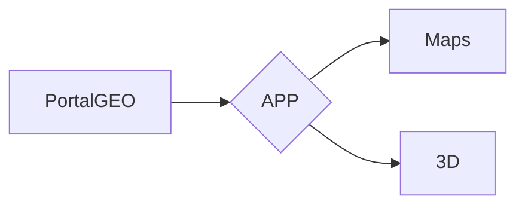

# Sobre o Projeto:
O metaverso trata-se de um projeto cujo o objeitovo é transformar o Brasil em um ponto de nuvem,

Exemplo: 

Geoportal- DF: <https://www.geoportal.seduh.df.gov.br/geoportal/> <br>
Geoportal - SP: <https://www.geoportal.com.br/Home> <br>

Principais tecnologias utilizadas:

Python
Drones DJI
OpenDroneMap


### TEMPLATES

```
1º - Mapa Georeferenciado
2º - Nuvem de pontos 3D
```


### FLUXOGRAMA/DIAGRAMA



### FONTE:

https://blog.betrybe.com/html/iframe-html/

### 1.0 - FASES DO PROJETO

<ul>
  
  <li>
    <p><b><code>1.1 - [VIRTUAL ENV] </code></b></p>
    <p><i> Instrução:  </i></p>
  </li>
  
  <li>
    <p><b><code>1.2 - [FRONT-END] </code></b></p>
    <p><i> Fase-1: https://www.youtube.com/watch?v=wCOInE7-E0I  </i></p>
  </li> 
  
  <li>
    <p><b><code>1.3 - [BACK-END] </code></b></p>
    <p><i>  </i></p>
  </li>
  
</ul>

